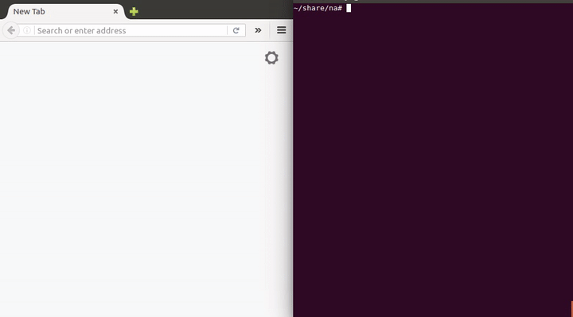

# Na
> Share your files with people next to you without having to send them under the ocean and back again.

[](https://travis-ci.org/srdja/na)
[](http://www.gnu.org/licenses/gpl-3.0)
   
**Na** allows you to easily share files over a local network by serving the current working directory through HTTP.

## Usage

```
na [OPTIONS]
```


Navigate to a directory that you wish to share and run `na`. Once it's running,
you'll be able to access the files from that directory from any device that's on the same network and has
a web browser (or something that understands HTTP).





## Options
```
-h | --help                  display help and exit  
-d | --dir [PATH]            specifies the path of the served directory (default is the working directory)
-p | --port [PORT]           specifies the port number (default 8888)
-i | --interface [INTERFACE] specify the network interface to use (eg. `eth0`, `wlo0`, `localhost`, etc...)  
-r | --enable-delete         enables file deletions through DELETE requests (disabled by default)
-u | --disable-upload        disables file uploads (enabled by default)
-s | --show-directory        show the path of the served directory to client (disabled by default)  
-l | --list-interfaces       print a list of available network interfaces and exit
-o | --overwrite-file        if enabled, uploaded files will overwrite existing files with the same name (disabled by default)  
-6 | --ipv6                  prefer IPv6 if available  
-v | --verbose               verbose output  
```


## Using Na without a browser

#### Obtaining a list of available files

Lists of available resources can be obtained either in JSON at `/json`, or
in a simple list form separated by a newline `\n` at `/list`.


##### An example of obtaining a list of files in JSON form:  
```
curl -X GET http://127.0.0.1:9000/json
```


```json
[
  {
    "name": ".cargo-lock",
    "url": "/files/.cargo-lock",
    "size": 0,
    "modified": "Tue, Aug 02 2016  02:08:53",
    "modified_raw": 1470096533
  },
  {
    "name": "na",
    "url": "/files/na",
    "size": 18404960,
    "modified": "Wed, Aug 03 2016  04:36:33",
    "modified_raw": 1470191793
  }
]

```

##### An example of obtaining a simple list of URLs separated by a newline `\n`:  
```
curl -X GET http://127.0.0.1:9000/list
```

```
/files/.cargo-lock
/files/na
```

##### Fetching a file:  
```
curl -X GET "http://127.0.0.1:9000/files/example.txt"
```

##### Uploading a single file:  
```
curl --form "upload=@example.txt" http://127.0.0.1:9000
```
```json
[
  {
    "source_name": "README.md",
    "saved_name": "README.md"
  }
]
```

##### Uploading multiple files in a single request:  
```
curl -F "upload[]=@example.txt" -F "upload[]=@example2.txt" http://127.0.0.1:9000
```
```json
[
  {
    "source_name": "README.md",
    "saved_name": "README.md (1)"
  },
  {
    "source_name": "build.rs",
    "saved_name": "build.rs"
  }
]
```

Deleting a file:  
```
curl -X DELETE "http://127.0.0.1:9000/files/example.txt"
```
**note**: `DELETE` is disabled by default, so it needs to be enabled by passing the `-r` or `--enable-delete` flag to `na`


## Installation

#### Linux  
Download **na**:  
```
sudo curl -L https://github.com/srdja/na/releases/download/v0.2.0/na-linux64 -o /usr/local/bin/na
```

Make **na** readable and executable for all users:  
```
sudo chmod a+rx /usr/local/bin/na
```

#### OS X 
Download **na**:  
```
sudo curl -L https://github.com/srdja/na/releases/download/v0.2.0/na-osx -o /usr/local/bin/na
```

Make **na** readable and executable for all users:  
```
sudo chmod a+rx /usr/local/bin/na
```

#### Windows  
Download the **na** [executable](https://github.com/srdja/na/releases/download/v0.2.0/na-win64.exe) and place 
it into a directory that you wish to share, or you can put it into a directory that's in your `PATH` if you
wish to use it from the command line.

## Building the project

Currently Rust [nightly](https://www.rust-lang.org/en-US/downloads.html) is required to build the project.  

- Build debug with `cargo build`
- Build release with `cargo build --release`


## License
GPLv3+


## Contributing

##### Bugs and Features

If you have a feature request, or have found a bug, feel free to open a [new issue](https://github.com/srdja/na/issues/new).

##### Pull Requests

To get started, fork the repo to your account and then clone your fork:
```bash
git clone https://github.com/yourusername/na.git
```
Once you're done making changes, commit your work and push it to your fork.
You can then open a [pull request](https://help.github.com/articles/using-pull-requests/) from your fork to the upstream repository. 
